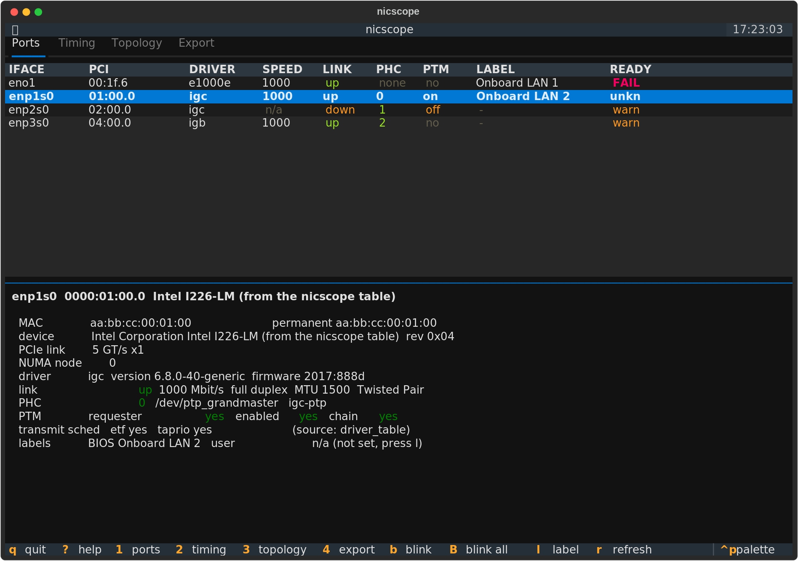

# nicscope

Inspect the network interfaces of a Linux measurement host, from a terminal.

It answers three questions:

1. **Which physical port is which?** MAC, PCI address, driver, BIOS silkscreen
   label, and an LED blink to find the port on the panel.
2. **Can this port carry precise time?** PHC, hardware timestamping, SDP pins
   for a PPS, PCIe PTM across the whole bridge chain, and a proven
   cross-timestamp.
3. **What does the topology look like, and how do I archive it?** A PCIe tree
   annotated with the PTM role of each level, and an export in five formats.

**nicscope is read-only.** It does not start `ptp4l`, it does not change a link
setting, and it does not write to a PHC. It is safe to run on a live
measurement system.

```
┌─ nicscope ─────────────────────────────────────────────────────────────┐
│ Ports │ Timing │ Topology │ Export                                     │
├────────────────────────────────────────────────────────────────────────┤
│ IFACE     PCI       DRIVER  SPEED  LINK  PHC  PTM  LABEL         READY │
│ eno1      00:1f.6   e1000e  1000   up    none no   Onboard LAN 1  FAIL │
│ enp1s0    01:00.0   igc     1000   up    0    on   Onboard LAN 2  unkn │
│ enp2s0    02:00.0   igc     n/a    down  1    off  -              warn │
│ enp3s0    04:00.0   igb     1000   up    2    no   -              warn │
├────────────────────────────────────────────────────────────────────────┤
│ enp1s0  0000:01:00.0  Intel I226-LM                                    │
│   PCIe link        5 GT/s x1      NUMA node  0                         │
│   PHC              0   /dev/ptp_grandmaster   igc-ptp                  │
│   PTM              requester yes   enabled yes   chain yes             │
└────────────────────────────────────────────────────────────────────────┘
```



`enp1s0` passes every functional check there. Its verdict stays `unkn` because
its firmware version is not in your known-good table yet, and nicscope will not
call an unverified firmware a pass. Add the version once you trust it, and the
port turns green. That rule runs through the whole tool.

## Install

nicscope needs Python 3.10 or newer. The collectors, the readiness rules and
every export format use the **standard library only**, so a field machine needs
no wheel to run the headless mode. Only the terminal interface needs
[Textual](https://textual.textualize.io/).

```sh
git clone https://github.com/SchmidL/nicscope
cd nicscope

pipx install '.[tui]'          # the interface, isolated
pip install --user '.[tui]'    # or into the user site
pip install --user .           # headless only, zero dependencies
```

## Use

```sh
nicscope                        # start the interface
nicscope --check                # the readiness table, and an exit code
nicscope --json > system.json   # the canonical document
nicscope --format md -o report.md
nicscope --diff last-campaign.json
```

`--check` sets the exit code, so it works in a pre-flight script:

```sh
nicscope --check --iface enp1s0 --plan-speed 1000 || exit 1
```

The exit code is `1` when any check fails. With `--strict` a warning or an
unknown also fails.

### Privilege

Most of the tool needs no root:

| Source | Needs root |
|---|---|
| sysfs: link, MAC, PCI, NUMA, PCIe link, PHC attributes | no |
| `ethtool -i -k -T -c -g -l -P` | no |
| `ip`, `udevadm`, `tc` | no |
| `ethtool -p` (blink the LED), `ethtool -m` (SFP page) | CAP_NET_ADMIN |
| `lspci -vvv` configuration space (this is where PTM lives) | yes |
| `dmidecode -t 41` (the BIOS port label) | yes |
| ioctl on `/dev/ptp<N>` (the cross-timestamp probe) | usually yes |

An unprivileged run does not guess. It marks each root-only field as
`n/a (needs root)` and shows the reason. Run under `sudo`, or pass `--sudo` to
call only the root-only commands through `sudo -n`.

## What it checks

The readiness table has one row for each question. The results are never merged
into a score, because a score hides which item failed.

| Check | Passes when | Why it matters |
|---|---|---|
| `phc_present` | `ethtool -T` reports a PHC index | `ptp4l` needs a clock |
| `hw_tx_timestamp` | `on` is in the transmit modes | a master stamps its own Sync |
| `hw_rx_filter` | `all`, or a `ptpv2-event` filter | a software filter adds jitter |
| `one_step` | `one-step-sync` is present | removes the Follow_Up message |
| `pps_input` | `n_external_timestamps > 0` | `ts2phc` needs it for a GNSS PPS |
| `pps_output` | `n_periodic_outputs > 0` | to drive another device |
| `ptm_endpoint` | `PTMCap: Requester:+` | precise cross-timestamp |
| `ptm_chain` | every bridge is a responder, and a level is Root | PTM fails silently without it |
| `ptm_enabled` | `PTMControl: Enabled:+` | the capability can be present and off |
| `cross_timestamp` | `PTP_SYS_OFFSET_PRECISE` returns | the measured result of the three above |
| `link_speed` | at or above `--plan-speed` | |
| `pcie_link` | `LnkSta` equals `LnkCap` | a narrow link adds read jitter |
| `firmware` | the version is in your known-good table | i225 and i226 errata |
| `numa` | the card and the process share a node | a remote node adds jitter |

A row is `pass`, `warn`, `fail` or `unknown`. **`unknown` is not `pass`.** It
means the tool could not answer, and it always prints why.

Each port also gets the exact linuxptp calls it implies, ready to copy:

```
ptp4l -i enp1s0 -H -m
phc2sys -s /dev/ptp_grandmaster -c CLOCK_REALTIME -w -m
ts2phc -c /dev/ptp_grandmaster -s generic -m
```

### The PTM chain

PTM is the reason a PHC-to-system-clock offset can be exact instead of a few
hundred nanoseconds out. It is a PCIe capability, so `ethtool` cannot see it,
and it needs the **whole chain**: the endpoint must be a requester, every bridge
above it must be a responder, and a level must be the PTM root.

A card that reports `Requester:+` under a root port that is not a responder
gives no benefit at all, and nothing warns you. nicscope walks the parent chain
in sysfs, reads each level, and names the level that breaks it:

```
WARN  ptm_chain   0000:00:1c.5 is not a responder
```

The `cross_timestamp` row is the measurement rather than the paperwork. nicscope
issues `PTP_SYS_OFFSET_PRECISE` on `/dev/ptp<N>` directly, with `fcntl.ioctl`
and no third-party module. If the call returns, PTM works right now. This
replaces `testptp -x` from the kernel tree.

## Export

One canonical JSON document. Every other format is derived from it, so a
headless run and the export screen produce the same bytes.

| Format | For |
|---|---|
| `json` | the archive, and the input to `--diff` |
| `markdown` | a report for the campaign logbook |
| `csv` | one flat row for each port, for a spreadsheet inventory |
| `dot` | the PCIe tree; render with `dot -Tsvg`, coloured by PTM state |
| `linuxptp` | draft `ptp4l.conf` and `ts2phc.cfg` fragments |

The linuxptp fragments are **drafts**. The interface names and the PHC device
paths are read from the machine and are correct, which is the part people get
wrong. Nothing else in them is tuned.

### Before a campaign

```sh
nicscope --json > campaign-2026-08-13.json
nicscope --diff campaign-2026-08-13.json      # before the next one
```

The diff matches ports on the **permanent MAC address**, never on the interface
name. A rename then reads as a change on one port, not as one port that
disappeared and another that appeared. It catches a swapped cable, a firmware
change, a renamed interface and a card that dropped to a narrower PCIe link.

### Labels

```sh
nicscope --label enp1s0="GNSS PPS in"    # or press `l` in the interface
nicscope --list-labels
```

Stored in `~/.config/nicscope/labels.json`, keyed on the permanent MAC address
so that a rename does not lose them.

## Record and replay

Every external read goes through one of two doors: the file system, or a
subprocess. `--record` writes both to a file, and `--replay` runs the whole tool
against that file with no hardware present.

```sh
# on the measurement host
sudo nicscope --record config.capture.json --json > system.json

# anywhere else, days later
nicscope --replay system.capture.json --check
nicscope --replay system.capture.json --format md -o report.md
```

This is how to send a bug report, how to look at a field machine from a desk,
and how the tests run without a NIC.

## Layout

```
src/nicscope/
  collectors/   sysfs  ethtool  lspci  ptp  dmi  udev  tsn  pciids  pipeline
  util/         fs  run  capture  context  ptp_ioctl
  model.py      one dataclass for each section of the JSON schema
  readiness.py  the rule table
  labels.py     persistent port labels
  diff.py       compare two exports
  export/       json  markdown  dot  csv  linuxptp
  tui/          app  ports  timing  topology  export  format
  cli.py        headless mode
  data/         drivers.json, devices.json — operator-maintained tables
```

Every collector obeys the same contract: it never raises, and a value it could
not read stays `None` and gains an entry in `errors` that names the source and
the reason. The interface reads that entry and prints it. A parse error in one
`ethtool` sub-command never kills the collection.

### The operator tables

`src/nicscope/data/devices.json` ships almost empty **on purpose**. A firmware
string that nobody has verified on your hardware is `unknown`, and nicscope
reports `unknown` as a warning, never as a pass. Fill `known_good_firmware`
from your own campaign notes. That list is the only one that means anything for
your measurement.

`src/nicscope/data/drivers.json` holds the transmit-scheduling offload by
driver. It is a hint. nicscope will not dry-run a `tc qdisc replace` to find
out, because that would change the queue discipline of a live interface. When
`tc qdisc show` reports an offload as configured, the observation replaces the
table entry.

## Development

```sh
python3 -m venv .venv && .venv/bin/pip install -e '.[dev]'
.venv/bin/pytest
.venv/bin/ruff check .
```

The tests run against `tests/fixtures/synthetic.capture.json`, a machine that
does not exist, assembled so that every branch a real host can take is covered
at once. Regenerate it with `python3 tests/fixtures/build_synthetic.py`.

## Out of scope

This tool inspects. It does not configure.

A monitor for a *running* `ptp4l` — offset, path delay, port state over the
management interface — is a good second tool. It does not belong in this one.

## Licence

MIT. See [LICENSE](LICENSE).
